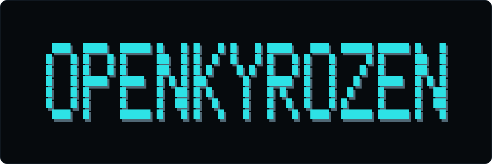

<p align="center">
  
  
  
</p>

<p align="center">
  
</p>

<h1 align="center">OpenKyrozen</h1>

<p align="center"><strong>実行し、記憶し、検証済みの結果から改善するローカル優先のターミナルエージェント。</strong></p>

## インストール

OpenKyrozen は Python **3.12 と 3.13** をサポートします。Python 3.14 は対象外です。

### macOS または Linux

```bash
curl -fsSL https://raw.githubusercontent.com/EvanProgramming/OpenKyrozen/v2.0.5/install.sh | sh
kyrozen
```

### Windows PowerShell

```powershell
irm https://raw.githubusercontent.com/EvanProgramming/OpenKyrozen/v2.0.5/install.ps1 | iex
kyrozen
```

インストーラーは対応する Python 環境、ターミナル UI、~/.kyrozen のプライベート状態を準備します。API key を読み取ったり表示したりしません。

初回起動時にプロバイダーを選び、キーを入力します。例：

```bash
export DEEPSEEK_API_KEY=your-key
kyrozen
```

### ソースから実行

```bash
git clone https://github.com/EvanProgramming/OpenKyrozen.git
cd OpenKyrozen
make install
make run
```

軽量な開発環境には make install-core を使います。Windows のソース環境では setup.bat と run.bat を使います。

### 検証済み release wheel を直接インストール

```bash
uv tool install --python 3.12 --force --with fastapi --with uvicorn https://github.com/EvanProgramming/OpenKyrozen/releases/download/v2.0.5/openkyrozen-2.0.5-py3-none-any.whl
```

## クイックスタート

```text
あなた：このプロジェクトを読み、アーキテクチャを説明して
あなた：tests/test_server.py の失敗したテストを修正して
あなた：最新の Python リリース日を検索して
あなた：REST endpoint 追加の計画を作って
```

よく使うコマンド：

```text
/provider              プロバイダーを切り替える
/mode ask|plan|agent   読み取り専用、計画、実行モードを選ぶ
/project               現在のワークスペースを確認する
/skills                インストール済みスキルを確認する
/learning status       自己学習の状態を確認する
/quit                  終了する
```

任意の Web UI は次で起動できます：

```bash
kyrozen-web
```

既定の URL は http://localhost:8000 です。特定のプロジェクトを操作する場合は kyrozen --project /path/to/project または kyrozen-web --project /path/to/project を使います。通常の kyrozen は ~/.kyrozen/workspace のグローバルワークスペースを使います。

## OpenKyrozen の要点

- ファイル、Shell、Git、Web 検索、ブラウザーセッション、プロジェクトグラフ、GitHub を同じワークスペースで扱えます。
- Ask と Plan は読み取り・ネットワーク操作だけを許可します。Agent は受理済みまたは明示的に依頼された作業を実行し、capability と approval の制約に従います。
- 18 個の主要なモデルプロバイダー、モデルの既定値、フォールバックをサポートします。
- SQLite がセッション、イベント、タスク、claims、学習状態の正式な保存先です。ChromaDB は再構築可能なオプションのインデックスです。
- 自己学習は結果の証拠を記録し、検証された改善だけを昇格させます。権限やモデル重みを暗黙に変更しません。
- Jev Decision は任意の判断レイヤーです。リクエストのルーティング、確認、学習の証拠、メモリの関連性、疑わしいツール出力を確認します。実行や承認は行わず、必要なら棄権します。

現在のランタイムには **46 個のツール**があり、そのうち **Git ツールは 14 個**です。ツール、endpoint、MCP schema の正式な一覧は[生成されたランタイム一覧](docs/tool-inventory.md)です。

## ドキュメント

| 内容 | ドキュメント |
| --- | --- |
| コマンド、モード、ワークスペース | [使用ガイド](docs/usage.md) |
| ランタイムと安全境界 | [アーキテクチャ](docs/architecture.md) |
| プロバイダー、環境変数、状態 | [設定](docs/configuration.md) |
| Web、REST、MCP | [API ガイド](docs/api.md) |
| 自動サブエージェント、独立コンテキスト、相互検証 | [サブエージェントガイド](docs/subagents.md) |
| 自己学習、メモリ、証拠 | [自己学習ガイド](docs/self-evolution.md) |
| Jev Decision と校正された証拠 | [Jev Decision](docs/decision-assist-validation.md) · [System One](docs/system-one-benchmark.md) |
| 他のオープンソースエージェントとの比較 | [比較](docs/comparison.md) |
| 開発、テスト、リリース | [開発ガイド](docs/development.md) |

DeepSeek の既定例は "model_simple": "deepseek-flash" と "model_complex": "deepseek-v4-pro" です。

## セキュリティと開発

プロバイダー資格情報は環境変数または暗号化された ~/.kyrozen_config.json に保存してください。Web サーバーを localhost の外へ公開する場合は KYROZEN_SERVER_TOKEN を設定し、capability と approval を確認してください。

```bash
make check
make docs-check
make test
make lint
```

詳しくは AGENTS.md、[設定とセキュリティ](docs/configuration.md)、[開発ガイド](docs/development.md)を参照してください。

## ライセンス

OpenKyrozen は [MIT License](LICENSE) で公開されています。

<p align="center"><sub><a href="README.md">English</a> · <a href="README.zh-CN.md">简体中文</a> · 日本語 · <a href="README.ko.md">한국어</a></sub></p>
